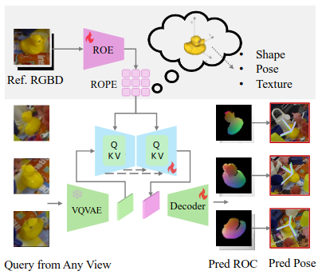

<div align="center">

## One2Any: One-Reference 6D Pose Estimation for Any Object
Mengya Liu<sup>1</sup>, Siyuan Li<sup>1</sup>, Ajad Chhatkuli<sup>2</sup>, Prune Truong<sup>3</sup>, Luc Van Gool<sup>1,2</sup>, Federico Tombari<sup>3,4</sup>

<p><sup>1</sup>ETH Zurich, &nbsp;&nbsp;<sup>2</sup>INSAIT, Sofia University “St. Kliment Ohridski”, &nbsp;&nbsp;<sup>3</sup>Google, &nbsp;&nbsp;<sup>4</sup>TUM  &nbsp;&nbsp;

[Paper](https://arxiv.org/pdf/2505.04109)
</div>




### Environment

```bash
git clone https://github.com/lmy1001/One2Any.git
cd One2Any
conda env create --file env.yaml
conda activate one2any_env
```

### Dataset
For model training, you need both ```oo3d_9d_dataset``` and ```foundationpose_dataset```.

For ```oo3d_9d_dataset```, please follow [here](https://github.com/caijunhao/ov9d) for data download and preparation.

For ```foundationpose_dataset```, please follow [here](https://github.com/NVlabs/FoundationPose) for data download and preparation.

### Training

```
./train.sh
```

### Test
Here is an example of evaluation on linemod dataset. You have to first download dataset from [BOP benchmark](https://bop.felk.cvut.cz/datasets/).

The pretrained model  can be downloaded [here](https://drive.google.com/drive/folders/1ui_5z-iV8xkv-g17QeVVe8JIFIhfOJQU?usp=drive_link), put in under ```./pretrained_model/```, and ```run```

```
./test.sh
```


### BibTex
If you find this project useful in your research, please cite:

```bibtex
@inproceedings{liu2025one2any,
  title={One2Any: One-Reference 6D Pose Estimation for Any Object},
  author={Liu, Mengya and Li, Siyuan and Chhatkuli, Ajad and Truong, Prune and Van Gool, Luc and Tombari, Federico},
  booktitle={Proceedings of the Computer Vision and Pattern Recognition Conference},
  pages={6457--6467},
  year={2025}
}
```

### Acknowledgements
This project is developed upon [OV9D](https://github.com/caijunhao/ov9d), [Oryon](https://jcorsetti.github.io/oryon/). We thank the authors for open sourcing their great works!